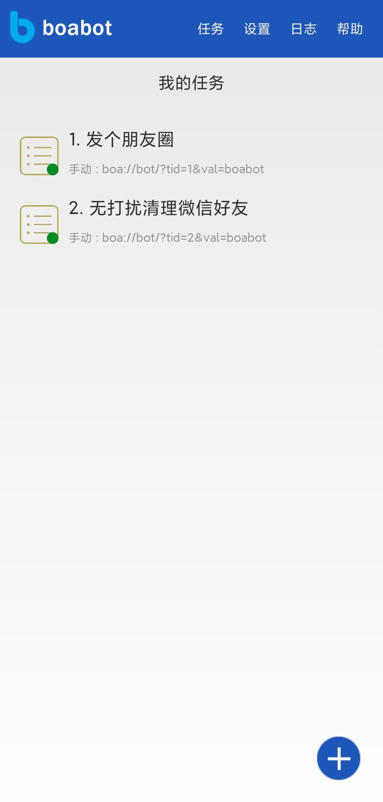
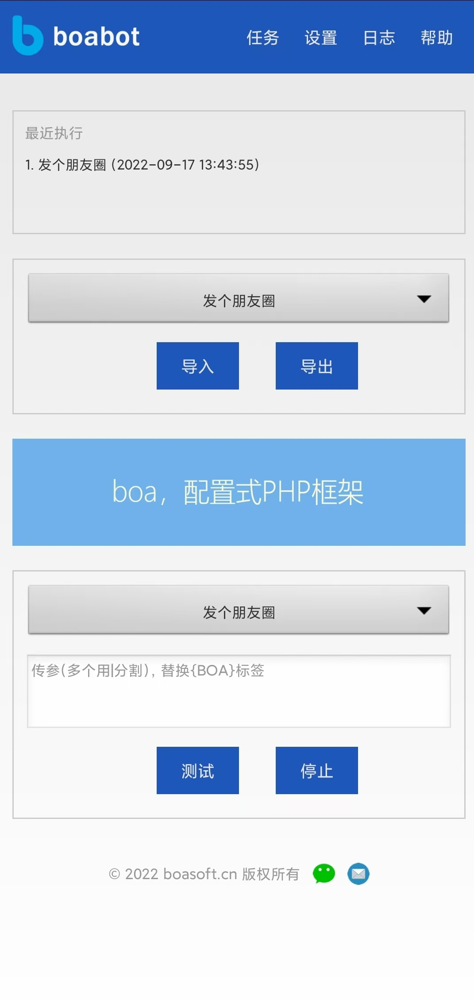
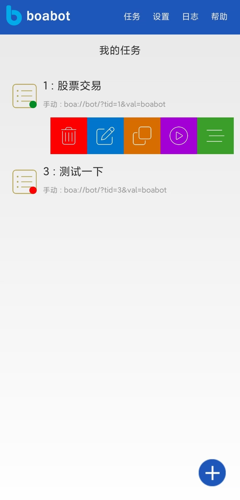
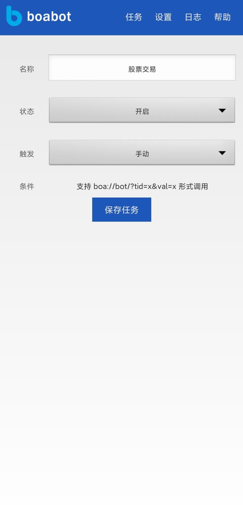
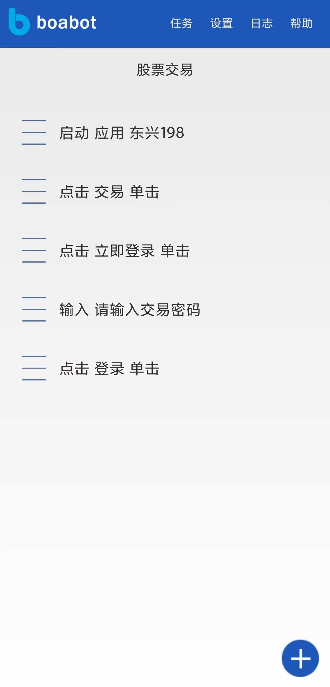
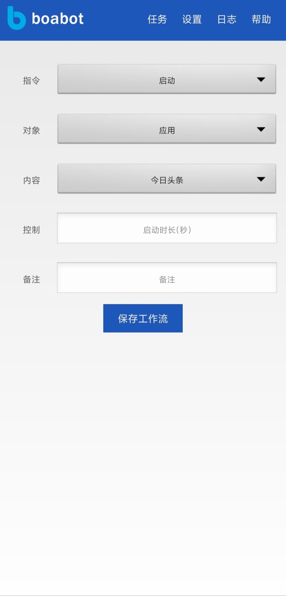
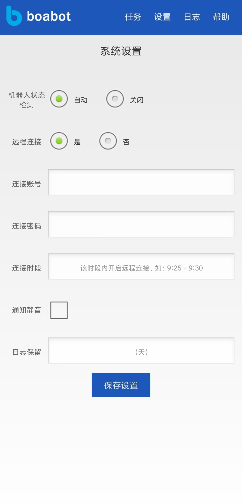

# boabot

一款通用的通过屏幕可视化触控操作即可操控其他应用和网页的安卓机器人，无需编程或手写脚本。

初衷是为了接收服务器指令自动操控炒股APP的，因未能实现远程指令自动解锁手机而中止开发，现释放源码供交流探讨。

服务器端股票系统公共部分源码释放为BOA框架（PHP）

## 注意：
1.默认可以在屏幕手动点击选取目标对象，对于隐藏较深的目标对象，可借助UIAutomatorViewer等可视化工具人工查找具有clickable属性的对象，并计算好层级关系；

2.内容支持输入带参数的URL由外部程序系统动态提供内容，比如集成chatGPT来实现智能回复；

## 屏幕截图

